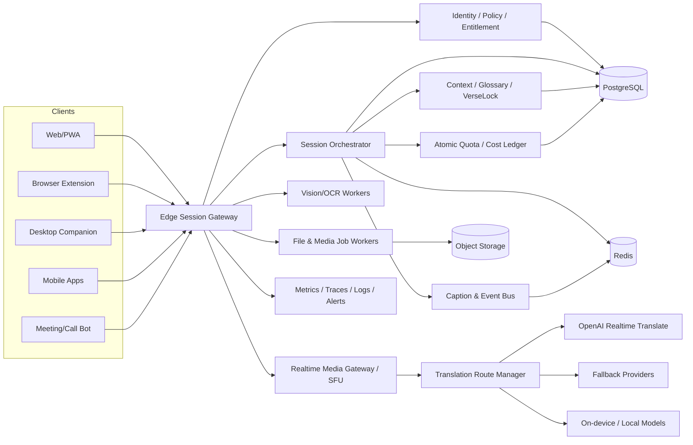

# LovingVoice Universal Translation OS

> Product & Engineering Blueprint v1.0 · 2026-09-03

## 0. 최종 제품 정의

LovingVoice는 더 이상 “강연자가 말하면 청중에게 번역 자막과 음성이 전달되는 웹페이지”가 아니다.

최종 제품은 **어떤 기기·앱·화면·통화·영상·문서에서도 언어 장벽을 제거하는 통합 번역 운영체제**다.

제품의 단일 원칙은 다음과 같다.

> 사용자는 번역 방식을 고르는 것이 아니라, 번역할 대상을 고른다. LovingVoice가 입력·언어·품질·지연·비용·출력을 자동 결정한다.

핵심 제품명은 임시로 **LovingVoice Universal**을 사용한다.

---

## 1. 현재 코드베이스 진단

현재 저장소는 다음을 이미 구현하고 있다.

- FastAPI 단일 서버
- 브라우저 AudioWorklet 기반 마이크 PCM 캡처
- 강연자 WebSocket → 서버 → OpenAI Realtime Translation WebSocket
- 언어별 번역 세션 공유 및 다수 청중 fan-out
- 원문/번역 자막 delta와 번역 PCM audio delta 전달
- Google STT + Gemini 번역/TTS 레거시 폴백
- 방 생성, HMAC 기반 강연자 토큰, 최근 자막, 기기 내 녹음
- 제한적인 연결·인증·번역 세션 테스트

그러나 제품화 전에 다음 구조적 한계를 제거해야 한다.

1. 모든 방·연결·자막 상태가 프로세스 메모리에 있어 다중 인스턴스와 재시작에 취약하다.
2. 브라우저 마이크 입력도 서버 WebSocket을 경유하므로 개인 통역에서는 불필요한 홉과 PCM 처리 부담이 생긴다.
3. 청중 입장권, 계정, 조직, 요금제, 원자적 예산 예약이 없다.
4. 기본 강연자 비밀번호 호환 경로를 제거하지 않으면 공개 배포에 부적합하다.
5. 입력이 사실상 마이크뿐이며 탭·시스템 오디오·통화·파일·카메라·OCR가 통합되지 않았다.
6. 단일 HTML/JavaScript 파일이 UI·미디어·WebSocket·녹음·재생을 모두 담당한다.
7. 번역 언어와 엔진 기능이 하드코딩되어 공급자별 capability를 동적으로 선택할 수 없다.
8. 지연·품질·비용·드롭률·재연결을 운영 지표로 측정하지 않는다.

따라서 기존 기능을 폐기하지 않고 **Control Plane / Media Plane / Intelligence Plane / Client Capture Plane**으로 분리한다.

---

## 2. 제품 표면: 하나의 홈, 여섯 개 모드

홈 화면은 기능 목록이 아니라 “무엇을 번역할 것인가?”로 시작한다.

### 2.1 Live Room — 예배·강연·행사·수업

- 한 명 또는 여러 명의 발표자
- QR/링크로 청중 입장
- 청중별 언어·자막·음성·원음 믹스 선택
- 언어별 공유 번역 트랙
- 운영자 콘솔, 통역사 takeover, 용어집, 비용·지연 모니터
- OBS/방송 송출, 프로젝터 자막, 웹 임베드

### 2.2 Conversation — 대면·상담·민원·선교

- 1:1 양방향 동시통역
- 각 사용자의 음성을 별도 트랙으로 유지
- 자동 화자·언어 전환
- 이어폰 분리 재생 또는 화면 양면 모드
- 끼어들기, 짧은 응답, 동시 발화 처리

### 2.3 Screen & Media — 화면·유튜브·OTT·게임·회의

- 브라우저 탭 또는 선택 화면의 음성을 실시간 번역
- 번역 자막 오버레이와 번역 음성 재생
- 화면 속 텍스트 OCR 번역
- 마우스 hover/영역 지정/일시정지 프레임 번역
- 원음 ducking, 번역 음성 지연 보정, 자막 싱크 보정

### 2.4 Call Bridge — 전화·SIP·화상회의

- 양방향 통화 통역
- 회의별 참가자·언어 자동 라우팅
- Zoom/Teams/Meet용 bot 또는 가상 마이크·스피커
- 통화 종료 후 다국어 회의록, 결론, 할 일, 검색

### 2.5 Camera & World — 표지판·책·메뉴·AR

- 카메라 장면 내 텍스트를 원래 위치에 번역 오버레이
- 문단·표·메뉴 레이아웃 유지
- 읽어주기, 발음, 단위·통화 변환
- 표지판·위험문·약관 우선 감지

### 2.6 Files & Text — 문서·이미지·영상 파일

- PDF, DOCX, PPTX, XLSX, HWP 변환 파이프라인
- 이미지·스캔 OCR
- MP3/WAV/MP4/MKV 자막·더빙
- SRT/VTT/ASS 생성 및 기존 자막 교정
- 레이아웃 보존 번역과 용어 일관성 검사
- 클립보드, 선택 텍스트, 드래그앤드롭, API

---

## 3. 클라이언트 전략: 웹 하나가 아니라 하나의 생태계

순수 웹만으로는 운영체제 전체의 화면·오디오를 항상 자동 수집할 수 없다. 사용자가 선택한 탭/창/화면은 웹에서 처리하고, OS 전체 기능은 보조 클라이언트가 담당한다.

| 클라이언트 | 담당 범위 | 핵심 캡처 계층 |
|---|---|---|
| Web/PWA | 마이크, 선택한 탭/화면, Live Room, 파일 | getUserMedia, getDisplayMedia, WebRTC |
| Chrome/Edge Extension | 현재 탭 자동 자막, DOM 번역, 탭 오디오, hover 번역 | tabCapture, content script, offscreen document |
| Windows Companion | 모든 앱의 시스템 오디오, 창/화면 OCR, 투명 오버레이, 가상 오디오 | WASAPI loopback, Windows Graphics Capture |
| macOS Companion | 시스템/앱 오디오, 화면·창 캡처, 오버레이 | ScreenCaptureKit |
| Android | 화면·재생 오디오, floating overlay, 카메라 | MediaProjection, AudioPlaybackCapture |
| iOS/iPadOS | 사용자가 선택한 화면 공유, 앱/마이크 오디오, 카메라 | ScreenCaptureKit/ReplayKit 및 시스템 picker |
| Server Media Worker | 방송 ingest, SIP, RTMP/SRT, 대규모 room fan-out | WebSocket media pipeline, SFU subscriber |

모든 클라이언트는 동일한 계정·용어집·세션·자막 이벤트·요금제·기기 정책을 사용한다.

---

## 4. 목표 아키텍처



### 4.1 Control Plane

- 사용자·조직·역할·요금제
- 방·세션·초대권·기기 등록
- 언어 route 예약
- 원자적 예산 reserve/commit/release
- 기능 플래그와 점진적 rollout
- 보존 기간·개인정보·녹음 동의 정책

### 4.2 Media Plane

- WebRTC ingress/egress
- 발표자·참가자별 독립 audio track
- 언어별 translated track
- adaptive jitter buffer
- 원음/번역음 mix와 ducking
- SFU 기반 대규모 fan-out
- RTMP/SRT/SIP/회의 bot 연동

### 4.3 Intelligence Plane

- 실시간 음성 번역
- 실시간 원문 전사
- OCR/vision translation
- 파일·영상 batch translation
- 용어·인명·숫자 검증
- 요약·질문·문화적 설명
- 품질 평가 및 공급자 fallback

### 4.4 Capture Plane

모든 입력을 공통 `SourceTrack`으로 정규화한다.

```ts
type SourceKind =
  | "microphone"
  | "tab_audio"
  | "system_audio"
  | "call_audio"
  | "media_file"
  | "camera"
  | "screen_region"
  | "clipboard"
  | "document";

interface SourceTrack {
  sourceId: string;
  kind: SourceKind;
  ownerId: string;
  mediaStream?: MediaStream;
  languageHint?: string;
  privacyClass: "public" | "private" | "sensitive";
  captureStartedAt: string;
}
```

---

## 5. 초저지연 통역 로직

### 5.1 연결 경로를 용도별로 분리한다

#### 개인·1:1·선택 탭 번역

```text
Device media track
  → direct WebRTC
  → Realtime Translation
  → remote translated audio track + transcript data channel
```

브라우저에서 캡처한 오디오는 서버 PCM relay를 거치지 않는다. 서버는 짧은 client secret 발급, 권한, 비용 예약, 세션 제어만 담당한다.

#### 강연·예배·방송·대규모 회의

```text
Speaker WebRTC
  → SFU / media worker subscribes once
  → one translation route per source track × target language
  → translated track republished once
  → unlimited listeners subscribe to shared language track
```

청중 수가 늘어도 번역 세션 수가 늘지 않아야 한다. 비용은 `활성 source track × 고유 target language`에 비례한다.

#### 전화·RTMP·서버 수집 오디오

```text
Telephony/Broadcast ingest
  → server media worker
  → Realtime Translation WebSocket
  → captions + translated audio track
```

### 5.2 Fast/Stable 이중 레인

자막은 한 번 완성될 때까지 기다리지 않는다.

```text
Audio 20 ms frames
  ├─ Fast lane: partial source → partial translation → 즉시 화면 표시
  └─ Stable lane: phrase boundary → 문맥 재평가 → 최소 diff correction → 확정 저장
```

이벤트는 `append-only text`가 아니라 revision을 지원한다.

```json
{
  "type": "caption.patch",
  "captionId": "cap_123",
  "revision": 4,
  "replaceFrom": 18,
  "replaceTo": 26,
  "text": "예수 그리스도",
  "stability": 0.92,
  "final": false
}
```

프런트엔드는 전체 문장을 지우고 다시 그리지 않고 변경 구간만 바꾼다. 이 방식이 깜빡임·독서 피로·자막 역행을 줄인다.

### 5.3 지연을 줄이는 구체 규칙

1. 언어 선택 즉시 translation route를 prewarm한다.
2. 첫 음성 이후 세션을 만들지 않는다.
3. 20 ms Opus/WebRTC를 기본으로 하고 서버 pipeline에서만 PCM16을 사용한다.
4. 60–180 ms adaptive jitter buffer를 적용한다.
5. backlog가 커지면 오래된 실시간 프레임을 버리고 늦게 재생하지 않는다.
6. source transcript와 target transcript를 별도 스트림으로 보낸다.
7. 자막을 음성보다 먼저 표시하고, 음성 지연 시 자막 기능을 계속 유지한다.
8. 네트워크 전환·백그라운드 복귀 시 ICE restart와 session resume를 수행한다.
9. RTT·packet loss·jitter·first-caption·first-audio를 client/server 양쪽에서 기록한다.
10. 서울·도쿄·싱가포르 edge 후보에 짧은 RTT race를 수행하고 방 단위로 sticky routing한다.

### 5.4 목표 SLO

수치는 보장이 아니라 실제 환경에서 통과해야 하는 제품 목표다.

| 지표 | p50 목표 | p95 목표 |
|---|---:|---:|
| 음성 → 원문 첫 자막 | 300 ms 이하 | 650 ms 이하 |
| 음성 → 번역 첫 자막 | 500 ms 이하 | 900 ms 이하 |
| 음성 → 번역 첫 음성 | 700 ms 이하 | 1.3 s 이하 |
| 네트워크 전환 후 재수신 | 1.0 s 이하 | 2.5 s 이하 |
| 자막 수정으로 인한 전체 재렌더 | 0회 | 0회 |
| 실시간 backlog | 250 ms 이하 | 500 ms 이하 |

---

## 6. 화면·영상·시스템 오디오 번역 파이프라인

### 6.1 선택 탭/화면 음성

```text
getDisplayMedia(audio + video)
  → audio track 확인
  → direct WebRTC translation
  → 번역 자막 overlay
  → translated remote audio
  → 원음/번역음 mix controller
```

오디오 트랙이 반환되지 않은 브라우저·공유 대상에서는 즉시 호환성 진단을 띄우고 확장 프로그램 또는 데스크톱 앱으로 전환한다.

### 6.2 화면 속 텍스트

매 프레임 전체 OCR를 돌리지 않는다.

```text
Screen frame
  → perceptual hash / motion diff
  → changed regions only
  → text detection
  → OCR
  → layout/reading-order reconstruction
  → translation memory lookup
  → changed strings only translate
  → anchored overlay
```

- 동일 문장은 번역 memory에서 즉시 재사용한다.
- 스크롤 시 기존 bounding box를 optical flow로 이동한다.
- 화면이 정지하면 고정밀 OCR로 승격한다.
- 비밀번호·카드·주민번호·OTP 패턴은 device-side redaction 후 전송한다.
- 영상 자막 영역은 OCR보다 subtitle track/WebVTT/DOM을 우선 사용한다.

### 6.3 원음과 번역 음성

세 가지 청취 모드를 제공한다.

- **통역 중심**: 원음 -18 dB ducking, 번역음 100%
- **학습 모드**: 원음과 번역음을 좌우 또는 시간차로 재생
- **자막 전용**: 음성 합성 없이 원음 + 번역 자막

화자 발화 속도가 번역 음성보다 빠르면 무작정 누적하지 않는다.

- 의미 단위 압축
- 번역 음성 rate 0.95–1.15 범위 자동 조절
- 침묵 구간에서 drift 회수
- drift 임계치 초과 시 음성은 핵심 의미형으로 전환하고 자막은 완전 번역 유지

### 6.4 보호 콘텐츠와 앱 정책

DRM, 보안 앱, 기업 정책, 플랫폼 capture policy가 차단하는 콘텐츠는 강제로 우회하지 않는다. 캡처 불가 상태를 감지해 사용자가 제공한 자막 파일·마이크 수음·공식 접근성 API 등 허용된 경로로 전환한다.

---

## 7. “이런 것까지 된다고?” 기능군

### 7.1 Universal Overlay

- 어떤 앱 위에도 투명 자막
- 화자 위치 또는 원문 위치에 anchor
- 클릭 통과, 글자 크기·배경·두 줄 제한
- 프로젝터/세컨드 모니터 전용 출력

### 7.2 Rewind Translation

기기 내 암호화 ring buffer에 최근 15/30/60초를 저장한다.

- “방금 뭐라고 했지?”를 누르면 마지막 문장을 다시 번역
- 원문·번역·느린 재생·단어별 보기
- 저장하지 않는 세션에서도 RAM ring buffer만 사용 가능

### 7.3 Meaning Lens

자막 한 줄을 누르면 다음을 별도 레이어로 설명한다.

- 직역/의역 차이
- 관용구와 문화적 맥락
- 존댓말·감정·확신도
- 숫자·통화·단위 변환
- 이름·장소·성경 구절 등 entity 카드

실시간 통역 본문은 해설 때문에 지연되지 않는다.

### 7.4 VerseLock / DomainLock

예배·설교·신학 강연을 위한 특화 계층이다.

- 성경 66권·인명·지명·교리 용어 고정
- “로마서 8장 28절” 등 구절 자동 검출
- 사용자가 선택한 번역본의 표기와 인용문 대조
- 교회·강사·행사별 용어집
- 이름·숫자·날짜를 일반 문장보다 높은 검증 우선순위로 처리

같은 구조로 의료·법률·제조·교육 용어집을 제공한다.

### 7.5 Language Autopilot

- 말하는 사람과 언어를 자동 감지
- code-switching 구간만 별도 처리
- 앱·사이트·연락처·방마다 기본 언어 자동 적용
- 상대방이 이미 이해하는 구간은 중복 음성 통역 억제

### 7.6 Human Takeover

전문 통역사가 AI 자막을 즉시 수정하거나 직접 음성을 송출한다.

- AI/사람 seamless handoff
- 수정 내용은 해당 행사 glossary와 evaluation set에 반영
- 청중 화면에는 출처와 확정 상태 표시

### 7.7 Multi-output Broadcast

한 발표를 동시에 다음으로 보낸다.

- 개인 휴대전화
- 교회/행사장 프로젝터
- OBS 자막 브라우저 source
- 유튜브/방송용 SRT/RTMP track
- 이어폰 번역 음성
- 외부 전광판
- API/Webhook

### 7.8 Smart Notes

세션 종료 후 단순 요약이 아니라 다음 산출물을 만든다.

- 언어별 전체 전사와 번역
- 결론·결정·할 일·질문
- 시간 링크가 있는 검색
- 발표 슬라이드/화면 장면과 발언 연결
- 용어·인명·숫자 검증 대기열
- 공개용/내부용/개인용 보존 정책 분리

### 7.9 Accessibility First

- 청각장애인용 자막 전용 초저지연 모드
- 큰 글자·고대비·난독증 친화 설정
- 화자별 시각 구분
- 키보드·스크린리더 전체 조작
- 진동/웨어러블 알림
- 자막 속도 제한과 읽기 지연 buffer

### 7.10 Local Survival Mode

인터넷 품질이 나빠지면 기능이 전부 중단되지 않는다.

```text
Cloud realtime degraded
  → on-device source captions
  → local phrase translation when available
  → cloud reconnect and silent reconciliation
```

오프라인 품질은 클라우드와 동일하다고 표시하지 않고 `LOCAL`, `DEGRADED`, `RECONNECTING` 상태를 명시한다.

---

## 8. 공급자 독립 Translation Router

“모든 번역 기능 통합”은 API를 무작정 많이 붙이는 것이 아니라 동일한 계약 아래에서 용도별 엔진을 선택하는 것이다.

```python
class RealtimeTranslator(Protocol):
    async def open(self, route: TranslationRoute) -> Session: ...
    async def update_context(self, context: ContextPatch) -> None: ...
    async def push_audio(self, frame: AudioFrame) -> None: ...
    async def events(self) -> AsyncIterator[TranslationEvent]: ...
    async def close(self) -> None: ...
```

### 8.1 Capability Registry

공급자별로 다음을 런타임 registry에 기록한다.

- 지원 언어/방언/방향
- speech-to-speech 여부
- partial transcript 여부
- browser WebRTC 여부
- server WebSocket 여부
- 평균 지연·최근 오류율
- 예상 분당 비용
- data residency/retention 조건
- glossary/custom vocabulary 지원
- on-device 가능 여부

### 8.2 선택 점수

```text
score =
  latency_weight × predicted_latency
+ quality_weight × pair_quality
+ cost_weight × estimated_cost
+ privacy_weight × policy_penalty
+ reliability_weight × recent_error_rate
```

사용자는 `속도`, `균형`, `정확도`, `보안`, `저비용` 정책만 선택한다. 공급자 이름은 관리자 화면에서만 노출한다.

### 8.3 Fallback 규칙

- 동일 세션 중 엔진 변경은 자막 revision boundary에서 수행한다.
- 음성 track 변경 전 150–300 ms crossfade를 적용한다.
- 자막과 음성의 엔진이 달라지면 UI에 품질 상태를 기록한다.
- 오류 발생 후 비용 reserve를 정확히 release한다.
- fallback이 원문 반복에 불과하면 “번역 성공”으로 기록하지 않는다.

---

## 9. 공통 이벤트 계약

모든 웹·앱·확장 프로그램·봇은 동일한 이벤트를 사용한다.

```ts
type TranslationEvent =
  | SessionStateEvent
  | SourceTranscriptDelta
  | TargetCaptionPatch
  | TargetAudioTrackEvent
  | SpeakerEvent
  | QualityEvent
  | CostEvent
  | PolicyEvent;
```

필수 필드:

```json
{
  "eventId": "evt_...",
  "sessionId": "ses_...",
  "routeId": "rte_...",
  "sourceId": "src_...",
  "speakerId": "spk_...",
  "sourceLanguage": "ko",
  "targetLanguage": "en",
  "sequence": 1042,
  "capturedAt": "2026-09-03T12:00:00.123Z",
  "emittedAt": "2026-09-03T12:00:00.581Z",
  "traceId": "trc_..."
}
```

이 계약을 먼저 고정해야 웹·확장·데스크톱·모바일을 병렬 개발할 수 있다.

---

## 10. 상태·데이터 구조

### PostgreSQL

- users, organizations, memberships
- devices, sessions, rooms, participants
- language_routes, invitations
- glossaries, glossary_terms, translation_memories
- usage_reservations, usage_ledger, plans
- recordings, transcripts, exports
- consent_records, retention_policies, audit_events

### Redis

- room presence
- ephemeral route ownership
- distributed locks
- reconnect resume cursors
- rate limits
- caption pub/sub or streams
- short-lived device/session tickets

### Object Storage

- 사용자가 저장에 동의한 원본 미디어
- 번역본·자막·내보내기
- 암호화된 녹음
- lifecycle policy에 따른 자동 삭제

프로세스 메모리는 캐시로만 사용하고 권한·예산·방 소유권의 source of truth로 사용하지 않는다.

---

## 11. 보안·개인정보·비용 원칙

1. 표준 API key는 서버 밖으로 나가지 않는다.
2. 브라우저/앱에는 짧은 client secret만 발급한다.
3. client secret 발급 전에 계정/초대권/요금제/정책/원자적 비용 reserve를 통과한다.
4. room code만으로는 권한을 부여하지 않는다.
5. host, audience, operator, interpreter, recorder 역할을 분리한다.
6. 기본 비밀번호와 자동 생성된 재시작별 signing secret을 production에서 금지한다.
7. 녹음·전사·화면 캡처는 각각 별도 동의와 상태 표시를 갖는다.
8. 기본 보존은 최소화하며 세션별 `RAM only`, `24 hours`, `30 days`, `custom`을 제공한다.
9. 화면 캡처 전에 민감 정보 영역 제외와 device-side redaction을 제공한다.
10. 공급자별 예상 비용을 route 시작 전에 표시하고 hard budget을 초과하면 생성 자체를 막는다.
11. 모든 민감 작업은 audit event를 남긴다.
12. DRM·보호 콘텐츠·플랫폼 정책을 우회하지 않는다.

---

## 12. UI 정보구조

### 12.1 홈

```text
무엇을 번역할까요?
[사람과 대화] [행사 열기] [화면/영상] [통화/회의] [카메라] [파일/문서]
```

기술 용어 `speaker`, `audience`, `engine`, `room ID`는 첫 화면에서 제거한다.

### 12.2 세션 화면

상단:

- 입력 대상
- 원문 언어 `자동/고정`
- 내 언어
- 현재 상태 `LIVE / DEGRADED / LOCAL / RECONNECTING`
- 지연·비용은 기본 축약, 클릭 시 상세

중앙:

- 현재 확정도 높은 번역 자막
- 이전 2–5개 문장
- 원문 표시 toggle
- 화자 표시

하단:

- 원음/번역음 slider
- 자막/음성/둘 다
- 되감기
- 용어 수정
- 종료

### 12.3 운영자 콘솔

- active speaker tracks
- target languages와 청중 수
- route별 p50/p95 latency
- packet loss/jitter/backlog
- 공급자/모델/region
- 분당·누적 비용과 hard cap
- glossary 적용 여부
- warning/error/fallback
- 강제 mute, route 재생성, human takeover

---

## 13. 저장소 목표 구조

```text
apps/
  web/                    # Next.js/PWA control surface
  extension/              # Chrome/Edge MV3
  desktop/                # Tauri + Rust native capture
  mobile-android/         # Kotlin/Compose
  mobile-ios/             # Swift/SwiftUI
services/
  api/                    # FastAPI control plane
  realtime-orchestrator/
  media-worker/
  vision-worker/
  file-worker/
packages/
  event-contracts/
  client-sdk/
  ui/
  observability/
infra/
  docker/
  terraform/
  k8s/
docs/
  adr/
  runbooks/
  evals/
evals/
  audio-golden-set/
  screen-golden-set/
```

현재 FastAPI 앱은 즉시 폐기하지 않는다. `/v1` control API로 정리하면서 기존 `/ws/speaker`, `/ws/audience`는 feature flag 아래 호환 경로로 유지한다.

---

## 14. 단계별 구현

### Phase 0 — Production Foundation

목표: 기능 추가보다 먼저 공개 사용 시 사고가 나지 않는 기반 확보.

- 기본 비밀번호 제거 및 production startup validation
- 계정/조직/역할/초대권
- 청중 ticket과 세션 scoped 권한
- PostgreSQL/Redis 이전
- 원자적 quota reserve/commit/release
- build SHA, release name, feature flag
- metrics/traces/log redaction
- provider error·timeout·reconnect 계약
- 현재 기능 characterization test

**완료 조건**

- 2개 이상의 API 인스턴스에서 동일 room 정상 동작
- 재배포 중 세션 상태 복구
- 무권한 client secret 발급 0건
- hard budget 초과 세션 생성 0건

### Phase 1 — Ultra-low-latency Core

- 개인 통역/1:1/선택 탭은 direct WebRTC
- Live Room은 speaker WebRTC → SFU/media worker
- 번역 언어 route prewarm
- source/target partial + caption patch protocol
- adaptive jitter/backlog drop
- 원음/번역음 mixer
- ICE restart/session resume
- latency SLO dashboard

**완료 조건**

- 실제 한국어↔영어 golden audio에서 목표 p50/p95 측정
- Wi-Fi↔5G 전환 후 자동 복구
- 50/100/500 청중 증가 시 번역 route 수 불변

### Phase 2 — Universal Web

- 선택 탭/창/화면 오디오 번역
- 실시간 자막·번역 음성
- 브라우저 호환성 진단
- 1:1 양방향 conversation
- 파일 오디오/영상 자막 생성
- QR/deep link 및 audio unlock test

### Phase 3 — Extension + Desktop

- DOM-aware webpage translation
- tabCapture 지속 처리
- hover/selection 번역
- Windows/macOS 시스템 오디오
- 모든 앱 위 투명 자막
- screen diff OCR와 anchored overlay
- global hotkey, clipboard, virtual mic/speaker

### Phase 4 — Mobile + Calls

- Android MediaProjection + playback audio + overlay
- iOS/iPadOS system picker 기반 capture
- 카메라 AR 번역
- meeting bot, SIP, 가상 오디오 device
- 이어폰·웨어러블 출력

### Phase 5 — Intelligence & Ecosystem

- VerseLock/DomainLock
- Translation memory
- Meaning Lens
- Rewind Translation
- Human Takeover marketplace/console
- developer API, SDK, webhooks
- on-device survival mode
- 지속 품질 evaluation과 자동 provider routing

---

## 15. 첫 구현 스프린트: 코드 단위 작업

다음 순서를 바꾸지 않는다.

### Sprint A — 안전한 세션 발급

1. `app/core/settings.py`
   - 환경 검증
   - production에서 기본 비밀번호·임시 secret 금지
2. `app/services/entitlements.py`
   - 세션 권한과 예산 reserve 계약
3. `app/api/realtime_sessions.py`
   - OpenAI translation client secret 발급
   - host/audience/device ticket 검증
4. `app/services/rate_limit.py`
   - Redis 기반 rate limit
5. 테스트
   - 권한 없음, 만료, replay, 예산 초과, provider timeout, reserve rollback

### Sprint B — Personal WebRTC Translator

1. `/universal` 신규 화면
2. microphone / selected tab / selected screen 선택
3. audio track 존재 확인
4. direct WebRTC 연결
5. translated remote track 재생
6. source/target caption delta 렌더
7. stop/close/reconnect
8. latency telemetry

### Sprint C — Event Contract 분리

1. JSON Schema 또는 Pydantic/TypeScript generated contracts
2. `caption.patch`, `route.state`, `quality.state`, `usage.tick`
3. 기존 WebSocket event adapter
4. 프런트엔드 전체 문장 덧붙이기 로직을 revision 기반으로 변경

### Sprint D — Persistent Room

1. room/participant/route를 PostgreSQL로 이전
2. presence와 caption stream을 Redis로 이전
3. 다중 worker 테스트
4. restart/rejoin/resume 테스트

---

## 16. 품질 검증 체계

### 16.1 Golden Set

- 한국어↔영어, 일본어, 중국어, 베트남어 우선
- 설교·예배·일상·회의·영상·소음 환경
- 성경 인명/지명/교리 용어
- 이름·전화번호·날짜·금액·백분율
- 빠른 말, 억양, code-switching, 겹침 발화

### 16.2 자동 지표

- WER/CER: source transcription
- COMET/BLEU 계열은 참고만 사용
- entity exact match
- number/date/currency exact match
- caption stability and revision distance
- first-caption / first-audio / end-of-utterance latency
- audio drift and underrun
- reconnect success
- cost per source minute × target language

### 16.3 사람 평가

- 이중언어 검수자의 의미 보존
- 예배·설교 신학 용어 적합성
- 자연스러운 구어체
- 존대·감정·강조 보존
- 자막 읽기 가능성과 음성 피로도

자동 점수만으로 출시하지 않는다.

---

## 17. 관측성과 운영

모든 route에 trace를 부여한다.

```text
capture.frame
→ edge.ingest
→ provider.append
→ source.delta
→ target.delta
→ audio.first_packet
→ client.playback
```

필수 대시보드:

- 지역/기기/브라우저별 latency
- 언어쌍별 품질 실패
- provider 오류와 fallback
- route/session/organization 비용
- dropped frames, jitter, audio underrun
- reconnect와 background resume
- OCR changed-region ratio와 cache hit

필수 runbook:

- Realtime provider 장애
- Redis/PostgreSQL 장애
- 특정 언어 품질 저하
- 비용 폭증
- 녹음/보존 사고
- client secret 남용
- 모바일 capture token 회수

---

## 18. 금지할 구현

- 모든 프레임을 서버로 보내 전체 OCR
- 청중 한 명마다 별도 번역 세션 생성
- 방 코드만으로 client secret 발급
- process dictionary를 권한·예산 source of truth로 사용
- 실시간 backlog를 보존해 몇 초 늦게 재생
- provider 실패 시 원문을 번역문으로 가장
- 전체 문장을 매 delta마다 지우고 재렌더
- 녹음·화면 캡처를 사용자가 모르게 시작
- DRM/보호 콘텐츠 우회
- 정확도·지연·비용을 측정하지 않은 채 “실시간” 또는 “완성” 표기

---

## 19. 출시 판정

다음 조건을 모두 통과할 때만 LovingVoice Universal을 정식 제품으로 부른다.

- [ ] Web/PWA 개인·Live Room·선택 탭 번역
- [ ] 1:1 양방향 분리 트랙
- [ ] Windows/macOS 시스템 오디오와 오버레이
- [ ] Android 및 iOS 허용 범위 capture
- [ ] 파일/영상/문서 번역
- [ ] persistent room, account, invitations, roles
- [ ] atomic quota와 비용 hard cap
- [ ] SLO dashboard 및 alert
- [ ] golden-set bilingual review
- [ ] privacy/consent/retention controls
- [ ] 장애·롤백·복구 runbook
- [ ] 접근성 테스트
- [ ] provider fallback과 local survival mode

---

## 20. 참고 기준

- OpenAI Realtime translation: https://developers.openai.com/api/docs/guides/realtime-translation
- OpenAI Realtime WebRTC: https://developers.openai.com/api/docs/guides/realtime-webrtc
- MDN Screen Capture API: https://developer.mozilla.org/docs/Web/API/Screen_Capture_API/Using_Screen_Capture
- Chrome tabCapture: https://developer.chrome.com/docs/extensions/reference/api/tabCapture
- Chrome offscreen: https://developer.chrome.com/docs/extensions/reference/api/offscreen
- Android playback/screen capture: https://developer.android.com/media/platform/av-capture
- Microsoft WASAPI loopback: https://learn.microsoft.com/windows/win32/coreaudio/loopback-recording
- Apple ScreenCaptureKit/ReplayKit: https://developer.apple.com/documentation/screencapturekit

---

## 결론

LovingVoice의 차별점은 번역 모델 하나가 아니다.

1. 모든 입력을 하나의 `SourceTrack`으로 통합하고,
2. 상황에 따라 WebRTC·WebSocket·SFU·native capture를 자동 선택하며,
3. 빠른 임시 결과와 안정적 확정 결과를 동시에 운영하고,
4. 자막·음성·화면·문서·회의록을 같은 세션 문맥으로 연결하며,
5. 지연·품질·비용·보안을 사용자가 확인할 수 있게 만드는 것

이 다섯 가지가 함께 작동할 때 LovingVoice는 단순 통역 웹앱이 아니라 **검증 가능한 실시간 언어 운영체제**가 된다.
